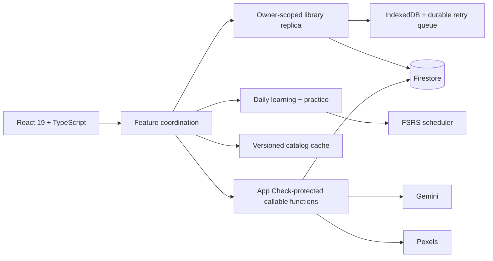

# SonFlash

<p align="center">
  
</p>

<p align="center">
  <strong>Build vivid vocabulary. Review it at exactly the right moment.</strong>
</p>

<p align="center">
  An offline-first English–Vietnamese learning workspace powered by AI-assisted card creation,
  evidence-based spaced repetition, and focused daily practice.
</p>

<p align="center">
  <a href="https://github.com/sonson0910/flash-card/actions/workflows/quality.yml"></a>
  
  
  
  
</p>


## Overview

SonFlash turns a word into a complete learning moment: meaning, pronunciation, context,
examples, related vocabulary, imagery, and a review schedule that adapts to memory strength.
It combines a fast personal vocabulary library with guided daily lessons, targeted practice,
learning paths, and progress insights.

The application is designed around three principles:

- **Memory first** — FSRS scheduling brings each card back when recall needs reinforcement.
- **Offline by default** — local persistence, bounded mirrors, and durable owner-scoped queues
  keep the learning flow available through unreliable connections.
- **Secure AI at the boundary** — production AI and image-provider credentials remain in
  App Check-protected Firebase callable functions, never in the browser bundle.

## Product highlights

| Area | What SonFlash provides |
| --- | --- |
| Smart card creation | Gemini-assisted English–Vietnamese definitions, IPA, examples, collocations, synonyms, antonyms, usage notes, and relevant imagery |
| Adaptive review | FSRS-based scheduling, explicit recall ratings, review history, mastery signals, and due-card prioritization |
| Daily learning | Focused sessions for recognition, active recall, spelling, listening, sentence work, and contextual practice |
| Learning paths | Personal progress routes plus versioned, provenance-aware catalog releases with offline activation |
| Offline ownership | Firestore persistent cache, IndexedDB-backed replicas, bounded pagination, per-user retry queues, and safe account switching |
| Library tools | Search, categories, import/export, duplicate handling, private sharing, and responsive card management |
| Progress | XP, memory-strength, category, and learning-state views with accessible alternatives |

## Architecture



The client keeps learner-owned data separate from shared catalog content. Firestore is the
source of truth for signed-in users, while the local replica coordinates pagination, mirrors,
tombstones, optimistic writes, offline replay, and owner transitions behind a narrow API.
Catalog releases are immutable and independently cached so shared content never inherits
private library ownership rules.

Production callable functions validate and bound every external input, enforce ownership and
rate limits, and use Firebase App Check before reaching AI or image providers.

## Technology

- **Application:** React 19, TypeScript 5.8, Vite 6, Tailwind CSS 4
- **Interaction:** Radix UI, Lucide, GSAP
- **Learning:** `ts-fsrs`
- **Cloud:** Firebase Authentication, Firestore, App Check, Hosting, and callable Functions
- **AI and media:** Firebase-protected Google Gemini generation and optional local media providers
- **Quality:** Vitest, Firebase Rules Unit Testing, Playwright, and axe-core

## Getting started

### Requirements

- Node.js `22.x` — the repository rejects unsupported major versions
- npm
- Java 21 when running Firestore Rules or the complete verification suite

### Install and run

```bash
nvm use
npm ci
npm ci --prefix functions
cp .env.example .env.local
npm run dev
```

Open [http://localhost:3000](http://localhost:3000).

AI-assisted card, story, and translation generation uses the protected Firebase callable.
It requires a signed-in Firebase user and client App Check, while Gemini credentials stay
in the server-side Secret Manager. Local emulator setup is out of scope. Pexels and
Unsplash keys remain optional development fallbacks; production never reads provider
secrets from `VITE_*` variables or ships them in the browser bundle.

### Environment variables

| Variable | Scope | Purpose |
| --- | --- | --- |
| `VITE_PEXELS_API_KEY` | Local development, optional | Enables direct Pexels image search |
| `VITE_UNSPLASH_API_KEY` | Local development, optional | Enables the Unsplash fallback |
| `VITE_FIREBASE_APP_CHECK_DEBUG` | Local development only | Enables the Firebase App Check debug-token flow |
| `ENFORCE_APP_CHECK` | Functions deployment | Controls callable App Check enforcement; defaults to enabled |

When using App Check locally, set `VITE_FIREBASE_APP_CHECK_DEBUG=true`, start the app, and
safelist the debug token printed in the browser console. Never commit that token.

Development also exposes a machine-local shared-device store at
`~/.lingoflash-device-sync/lingoflash-2-cards.json`. Production uses authenticated,
owner-isolated Firestore persistence instead.

## Quality gates

```bash
# Type checking
npm run lint

# Unit and component tests
npm test -- --run

# Firestore Rules tests (requires Java 21)
npm run test:rules

# Production build and all three browser engines
npm run test:e2e

# Complete release verification
RELEASE_REVISION="$(git rev-parse HEAD)" npm run verify
```

`npm run verify` covers application and Functions type checks, unit tests, Firestore Rules,
the production build, secret and bundle scans, Chromium/Firefox/WebKit journeys, dependency
audits, and release-readiness evidence. For release-grade evidence, run it from a clean
checkout and bind it to the exact 40- or 64-character source revision.

## Production releases

Production deployment is workflow-only. Local production deploys are intentionally not part
of the supported release path.

Public Firebase and App Check configuration is sealed in `firebase-applet-config.json`.
The browser selects a target only from an approved Hosting hostname; unknown deployed
hosts fail closed.

1. [`release-candidate.yml`](./.github/workflows/release-candidate.yml) builds once, verifies
   the exact artifact, and seals revision and digest evidence.
2. [`deploy-staging.yml`](./.github/workflows/deploy-staging.yml) verifies that exact artifact
   against the protected staging target, deploys without rebuilding, and emits a target-bound receipt.
3. [`deploy-production.yml`](./.github/workflows/deploy-production.yml) promotes the verified
   candidate through protected Hosting and Functions environments.
4. [`deploy-firestore-rules.yml`](./.github/workflows/deploy-firestore-rules.yml) performs the
   separately approved Firestore Rules cutover with migration and rollback evidence.

Environment-specific deployment identity belongs in protected GitHub environments.
Staging uses GitHub OIDC Workload Identity Federation through
`GCP_WORKLOAD_IDENTITY_PROVIDER` and `GCP_SERVICE_ACCOUNT`; no long-lived staging key is
stored. Keep target IDs and origins in protected environment variables.

See the [production rollout runbook](./docs/runbooks/phase-6-rollout.md) for candidate
provenance, App Check observation, smoke testing, promotion, and rollback procedures.

## Project map

```text
src/app/                  Application composition and feature coordination
src/features/library/     Owner-scoped library domain and replica
src/features/dailyLearning/ Today, lesson, placement, and progress experiences
src/features/practice/    Quiz, spelling, study, and story sessions
src/features/catalog*/    Catalog validation, cache, and workspace
functions/src/            Protected Firebase callable functions
e2e/                      Cross-browser product and accessibility journeys
docs/architecture/        Architecture decision records
docs/runbooks/            Production operating procedures
```

Start with the [architecture decisions](./docs/architecture/) when changing persistence,
catalog ownership, lesson coordination, releases, or sharing semantics.

## Security notes

- Provider secrets are server-side in production and scanned out of build artifacts.
- Private cards, progress, queues, and share ownership are scoped to the authenticated UID.
- Shared links are bounded to 100 cards and expire logically at the callable-provided time;
  physical TTL deletion may occur later.
- Catalog publication requires provenance, license, version, checksum, and editorial review
  metadata.
- Destructive migrations and Rules cutovers require revision-bound rollback evidence.

Please avoid reporting sensitive vulnerabilities in public issues. Share only the minimum
reproduction data necessary and never include credentials, private learning content, or
decryption material.
