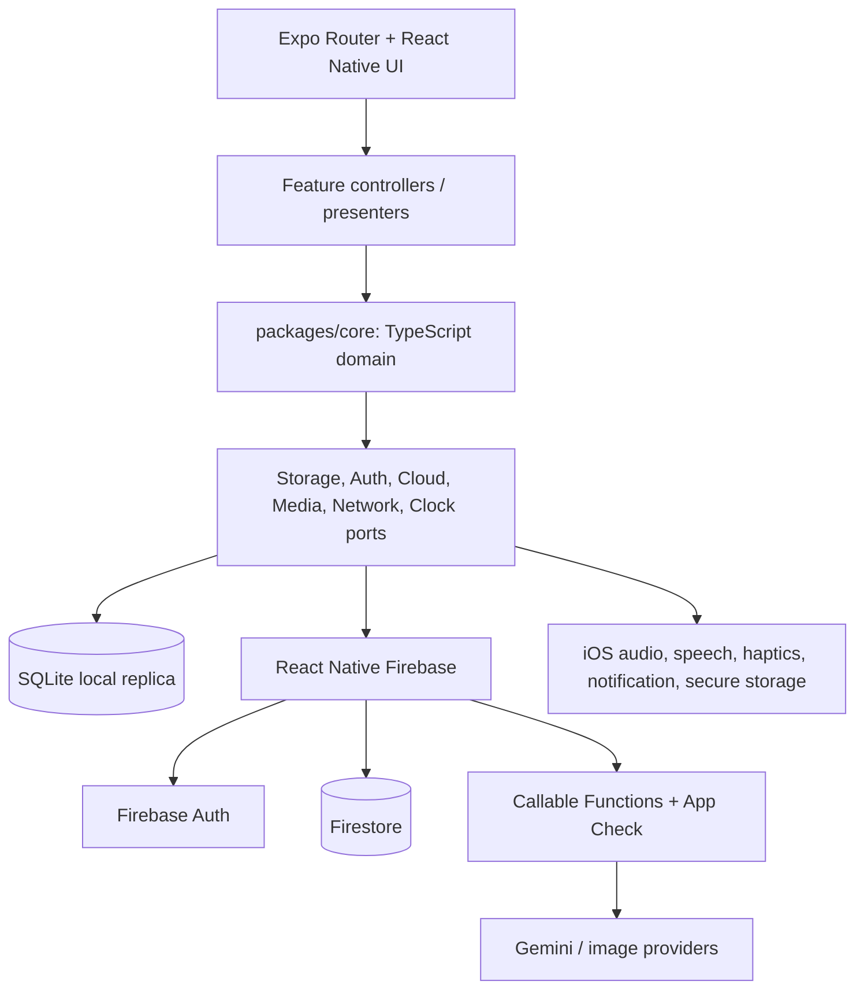

# Kế hoạch end-to-end xây dựng Lingo Flash cho iOS

Ngày lập: 2026-08-21
Trạng thái: **Đề xuất để duyệt; chưa bắt đầu triển khai**
Phạm vi: đưa sản phẩm web hiện tại lên một ứng dụng iOS native, giữ nguyên dữ liệu và backend Firebase, tiến tới parity chức năng có kiểm soát.

> **Cập nhật phạm vi 2026-08-21:** chủ dự án chỉ cần dùng cá nhân và không có Apple Developer Program 99 USD. Vì vậy kế hoạch App Store/native production này **không còn là roadmap ưu tiên**. Kế hoạch hiện hành là [Lingo Flash trên iPhone cho mục đích cá nhân, không trả phí Apple Developer](ios-personal-free-account-plan-2026-08-21.md). Tài liệu này được giữ lại nếu sau này cần App Store/TestFlight hoặc phân phối cho người khác.

> Tên trong codebase hiện chưa thống nhất: package/repository dùng `lingoflash`, nhiều nội dung sản phẩm dùng **SonFlash**, còn yêu cầu hiện tại dùng **Lingo Flash**. Kế hoạch tạm gọi sản phẩm là **Lingo Flash**; Phase 0 phải chốt tên, bundle ID và domain trước khi tạo App Store record.

## 1. Kết luận điều hành

### Kiến trúc được đề xuất

Xây app bằng **React Native + Expo development build**, dùng **React Native Firebase** để kết nối Firebase native SDK trên iOS. Không dùng Expo Go cho dự án thực tế vì Firebase native modules, App Check, Crashlytics và các khả năng native phải được đóng vào binary.

Lý do chọn hướng này:

- Logic cốt lõi hiện tại đã là TypeScript và có nhiều module thuần, có test tốt: card identity, normalization, mutation protocol, FSRS, daily plan, lesson reducer, script scoring, placement, practice model, schema v3 và catalog contracts.
- UI React DOM hiện tại không thể tái sử dụng trực tiếp trên React Native, nhưng mô hình/presenter và domain engine có thể tái sử dụng sau khi tách khỏi browser/Firebase adapter.
- Firebase native SDK phù hợp hơn Firebase Web SDK cho offline persistence, App Check, Crashlytics, Analytics, credential persistence và lifecycle của iOS.
- Expo vẫn cho phép native modules thông qua development build/prebuild, đồng thời rút ngắn cấu hình signing, TestFlight và App Store bằng EAS Build/Submit.
- Hướng SwiftUI thuần sẽ cho UI native nhất nhưng buộc viết lại gần như toàn bộ domain TypeScript và test; WebView nhanh hơn trong ngắn hạn nhưng không giải quyết tốt offline, native auth, speech, notification, accessibility và trải nghiệm App Store.

### Mốc sản phẩm đề xuất

| Mốc | Phạm vi | Điều kiện ra mốc |
| --- | --- | --- |
| Architecture proof | Firebase/Auth/App Check, named Firestore database, SQLite và speech chạy trên thiết bị thật | Kết thúc Phase 1 |
| Internal alpha | Đăng nhập, owner isolation, thư viện offline, tạo/sửa/xóa và sync | Kết thúc Phase 4–5 |
| TestFlight MVP | Today, AI card intake, FSRS Study, thư viện, Progress cơ bản, notification | Kết thúc Phase 6–7 |
| Release candidate | Parity các luồng đã chốt, bảo mật, accessibility, performance, privacy, release gates | Kết thúc Phase 8 |
| App Store GA | TestFlight đạt ngưỡng, App Review thông qua, rollout có giám sát | Kết thúc Phase 9 |

### Ước lượng tổng thể

- Một senior React Native/iOS làm chính, QA và design hỗ trợ bán thời gian: **22–26 tuần** cho full GA parity thực tế.
- Hai kỹ sư (mobile + core/backend), QA/design hỗ trợ: **15–18 tuần**.
- Ba kỹ sư có thể chia mobile UI, data/sync và feature parity, QA/design hỗ trợ: **12–15 tuần**; vẫn phải giữ Phase 0–1 và data contract theo thứ tự.
- MVP TestFlight tập trung Today + Vocabulary + Study + offline sync có thể sớm hơn khoảng **8–12 tuần** với đội hai người.
- Thời gian trên chưa bao gồm việc sản xuất và duyệt một catalog có bản quyền. Catalog hiện tại chưa có release publishable; nếu “Paths có nội dung reviewed” là điều kiện GA thì đó là một workstream nội dung riêng.

### Nguồn lực tối thiểu

| Vai trò | Trách nhiệm chính | Mức tham gia đề xuất |
| --- | --- | --- |
| Product owner | Scope, brand, App Store copy, metric/rollout decisions | 0.2–0.3 FTE xuyên suốt |
| Product designer | Native IA, design system, accessibility, screenshots | 0.5 FTE Phase 0–3 và 7–9 |
| Mobile lead | Expo/RN architecture, native lifecycle, UI, EAS/release | 1 FTE |
| Core/backend engineer | Shared package, SQLite/sync, Firebase/Functions/Rules | 1 FTE |
| QA/automation | Device matrix, E2E, VoiceOver, TestFlight acceptance | 0.5 FTE sớm; 1 FTE Phase 6–9 |
| Security/privacy reviewer | Threat model, deletion, privacy labels, release review | Theo checkpoint Phase 0, 4 và 8 |

Với một kỹ sư duy nhất, cùng người đó phải giữ cả mobile UI và data/sync critical path nên không nên tính các workstream là song song.

### Lịch tham chiếu cho đội hai kỹ sư

| Tuần | Critical path | Workstream song song hợp lệ |
| --- | --- | --- |
| 1 | Phase 0: quyết định, baseline, privacy/data map | Design IA và App Store ownership setup |
| 2–3 | Phase 1: Expo, Firebase/App Check/named DB, SQLite, speech spikes | CI và native design exploration |
| 4–5 | Phase 2: shared core/ports | Phase 3 design system, shell bằng fake ports |
| 6–8 | Phase 4: local replica, queue, sync, account transitions | Auth/settings và Vocabulary read-only UI |
| 8–10 | Phase 5: card intake/mutations/media/import/share | Hoàn thiện library presentation và accessibility |
| 10–12 | Phase 6: Today, lessons, Study, practice | Progress/gamification adapters |
| 13–14 | Phase 7: Progress, catalog, notifications | TestFlight alpha và remediation sớm |
| 15–16 | Phase 8: security, privacy, accessibility, performance, release gate | App Store assets/metadata |
| 17–18 | Phase 9: external beta, seal, review, phased rollout | Hotfix/rollback rehearsal và post-launch setup |

Lịch này là target planning, không phải deadline cố định. Một failure ở named database, App Check hoặc sync checkpoint phải dời feature work thay vì bỏ gate.

## 2. Hiện trạng codebase và những gì có thể tái sử dụng

### Nền tảng hiện có

- React 19, TypeScript 5.8, Vite 6 và Tailwind CSS 4.
- Firebase Authentication, Firestore, App Check, Hosting và callable Functions.
- Gemini/Pexels chỉ được gọi qua Functions có Auth/App Check/rate limit trong production.
- Offline-first với Firestore cache, IndexedDB mirror, pending mutation queue, revision, library epoch và tombstone.
- FSRS scheduling qua `ts-fsrs`.
- Vitest, Firestore Rules emulator, Playwright, axe và release artifact gates.
- Bốn destination chính: Today, Paths, Vocabulary, Progress.
- Practice: Study, Quiz, Spelling, Story, Word Match và Shadowing.
- Import/export spreadsheet, shared decks, AI dialogue/extractor, gamification và browser extension.

### Phần tái sử dụng trực tiếp sau khi tách package

- `src/types/card.ts`
- `src/lib/cardIdentity.ts`
- `src/lib/cardNormalization.ts`
- `src/lib/cardMutationProtocol.ts`
- `src/lib/reviewScheduler.ts`
- `src/lib/srs.ts`
- `src/lib/speechMatch.ts`
- Các engine thuần trong `src/features/dailyLearning/`
- `src/features/practice/practiceModel.ts`
- `src/features/practice/practiceSessionLifecycle.ts`
- Schema, identity, validation, compatibility và migration thuần trong `src/features/multilingual/`
- Catalog contracts, validation, progress, presentation models và các orchestration thuần.
- Các test fixture và invariant test tương ứng.

### Phần tái sử dụng qua port/adapter

- Card repository và conflict recovery.
- Identity session controller.
- Library Replica contract.
- Learning persistence contract.
- Gamification store contract.
- Shared deck service/controller.
- Catalog delivery/workspace service.
- AI generation client và protected-call capability.

Các module này giữ domain contract, nhưng implementation dùng Firebase Web SDK, IndexedDB, Web Storage hoặc browser lifecycle phải có adapter iOS mới.

### Phần phải viết lại

- Toàn bộ React DOM presentation (`*.tsx`) sang React Native components.
- Tailwind/Radix/GSAP/Lucide React DOM usage sang design tokens, React Native primitives và icon/animation tương thích mobile.
- Browser URL/history navigation sang Expo Router/deep link.
- IndexedDB, `localStorage`, `navigator.onLine`, Web Speech API, Web Audio và DOM focus.
- Playwright browser E2E cho luồng mobile; logic tests vẫn giữ.
- Browser extension bridge. Trên iOS, khả năng tương đương là Share Sheet/Share Extension và nên là post-MVP.

### Các blocker hiện hữu phải được giữ đúng sự thật

- `public/catalog/english-core/` chưa có release artifact; English/Japanese/Korean/Chinese vẫn `unavailable`.
- Catalog tests hiện chứng minh runtime contract bằng fixture, không chứng minh license/editorial/publication.
- Chưa có bằng chứng staging thực cho Auth/App Check/Firestore/AI/image.
- Chưa có bằng chứng production canary hoặc rollback thực.
- iOS không được dùng fixture như nội dung public và không được gọi trạng thái local-test là production-ready.

## 3. Phạm vi sản phẩm

### V1 MVP bắt buộc

- Onboarding ngắn, guest mode và account mode.
- Google Sign-In và Sign in with Apple.
- Today, daily plan, sáu loại lesson hiện có và Continue Review.
- Vocabulary: list, search, filter, card detail, bookmark, deck, add/edit/delete.
- AI-assisted card creation qua Functions hiện có.
- FSRS Study và review rating Again/Hard/Good/Easy.
- Offline-first local library, durable pending queue, owner-safe sync và manual retry.
- Progress cơ bản: XP, streak, due/reviewed/mastery summaries.
- Pronunciation playback, haptic và local due-review notification.
- Dark mode, Dynamic Type, VoiceOver, Reduce Motion và permission-denied states.
- Settings, sign-out, export data và delete account.
- Crash reporting/operational metrics không chứa từ, bản dịch, email, UID hoặc nội dung học.

### V1 GA parity sau MVP

- Quiz, Spelling, Word Match, Story.
- Shadowing với native speech recognition sau khi spike xác nhận độ chính xác/quyền riêng tư.
- Spreadsheet import/export bằng document picker/share sheet.
- Shared deck qua Universal Links.
- AI dialogue và word extractor.
- Paths cá nhân; reviewed catalog chỉ bật khi có release publishable.
- Đồng bộ gamification đầy đủ và biểu đồ Progress.

### Post-GA

- iOS Share Extension để nhận từ/câu từ Safari hoặc app khác.
- Home/Lock Screen widget.
- Live Activity cho phiên học.
- iPad layout tối ưu riêng.
- Android nếu muốn tận dụng cùng codebase.
- Subscription/IAP; không đưa vào V1 khi sản phẩm hiện tại chưa có monetization contract.

### Không làm

- Không bọc web app trong một WebView để gọi là bản iOS hoàn chỉnh.
- Không đổi Firestore schema chỉ để phù hợp UI mobile.
- Không tạo review scheduler thứ hai.
- Không đưa Gemini/provider key vào app bundle.
- Không tin client để cấp quyền, rate limit hoặc xác nhận ownership.
- Không phụ thuộc background execution để bảo đảm sync; iOS có thể trì hoãn hoặc từ chối background work.
- Không publish catalog draft/fixture.

## 4. Kiến trúc mục tiêu



### Cấu trúc repository đề xuất

```text
apps/ios/
  app/                    Expo Router routes
  src/app/                composition root, providers
  src/features/           mobile feature controllers + screens
  src/platform/firebase/  RN Firebase adapters
  src/platform/storage/   SQLite repositories and migrations
  src/platform/native/    audio, speech, haptics, notification, links
  src/ui/                 tokens and reusable native components
  e2e/                    mobile journeys
packages/core/
  src/card/
  src/learning/
  src/practice/
  src/catalog/
  src/multilingual/
  src/contracts/
  test-fixtures/
functions/                giữ backend hiện tại
src/                      giữ web app, chuyển dần sang import packages/core
```

Không di chuyển toàn bộ web app vào `apps/web` ngay ở Phase 1. Đó là churn lớn nhưng không tạo giá trị cho iOS. Root web app được giữ nguyên; chỉ thêm npm workspace và trích `packages/core` theo từng vertical slice.

### Quy tắc của `packages/core`

- Không import React, React Native, Firebase, Expo, DOM, IndexedDB hoặc Web Storage.
- Không dùng `window`, `document`, `navigator`, `File`, `import.meta.env` hoặc browser-only crypto.
- Clock, random ID, network, persistence và media đi qua port.
- Chạy được trong Node/Vitest và Hermes.
- Web và iOS cùng chạy một contract fixture để phát hiện sai khác behavior.
- Không copy logic sang mobile; phải move hoặc export một nguồn duy nhất.

### Navigation iOS

```text
(tabs)
├── today
├── paths
├── vocabulary
└── progress

Stack/modals
├── onboarding
├── auth
├── card/[id]
├── card/new
├── lesson/[mode]
├── practice/[mode]
├── shared-deck/[shareId]
├── import
└── settings
```

- Landing page web được thay bằng onboarding và first-run state; người dùng quay lại app đi thẳng vào Today.
- Shared URLs dùng Universal Links. Custom scheme chỉ là fallback/debug, không phải public share link chính.
- Back gesture, state restoration và deep link phải không làm mất pending mutation hoặc lesson progress.

## 5. Data, offline và sync contract

### Local database đề xuất

SQLite là local source cho UI và durable queue. Không dùng AsyncStorage cho thư viện lớn.

| Table | Mục đích |
| --- | --- |
| `schema_migrations` | version local schema, checksum và migration state |
| `owners` | owner scope, epoch đã verify, sync checkpoint |
| `cards` | normalized local projection của CardData |
| `card_tombstones` | delete barrier và revision |
| `pending_operations` | create/patch/review/delete command bền vững |
| `custom_decks` | deck theo owner |
| `gamification` | local XP/streak projection và pending XP stream |
| `catalog_releases` | release metadata/activation state |
| `catalog_lexemes` | cached immutable content |
| `catalog_memberships` | track/tier/topic/skill indexes |
| `media_cache` | cache key, path, etag/expiry, size; không chứa token |

Mọi bảng dữ liệu người học phải có `owner_id` trong key/index. Anonymous owner dùng một opaque local ID, không dùng literal `null` làm shared namespace.

### Local-first mutation sequence

1. Validate và normalize input bằng shared core.
2. Trong một SQLite transaction: cập nhật local projection và ghi pending operation.
3. UI đọc lại local state ngay, hiển thị trạng thái pending.
4. Sync chạy khi app foreground, network trở lại, user bấm Retry hoặc background window được iOS cấp.
5. Cloud adapter áp dụng command với `opId`, `baseRevision`, `fieldMask`, `libraryEpoch` và transaction hiện có.
6. Ghi authoritative result vào SQLite trước, sau đó mới acknowledge pending operation.
7. Conflict được phân loại thành rebase/retry/user-action; không silent overwrite.
8. Account switch hủy observer/task cũ, đóng owner scope cũ rồi mới mở owner mới.
9. Clear-all tăng library epoch; thiết bị offline cũ không thể resurrect dữ liệu.

### Firebase environments

- Tối thiểu ba environment: development, staging, production.
- Mỗi environment có bundle ID/Firebase iOS app riêng.
- Production và staging không dùng chung dữ liệu người học hoặc App Check enforcement state.
- Firebase config là public configuration nhưng vẫn phải environment-bound và không được lẫn project.
- App Check trên iOS: App Attest là provider chính, DeviceCheck fallback, debug provider chỉ cho development/simulator.
- Phải spike sớm việc truy cập **named Firestore database** đang dùng. Không giả định RN Firebase tự động dùng đúng database ID.

## 6. Dependency graph

```text
Brand + bundle IDs + Apple/Firebase ownership
│
├── Expo/EAS scaffold
│   ├── RN Firebase + named database + App Check proof
│   ├── SQLite proof
│   └── audio/speech/notification proof
│
├── packages/core extraction
│   ├── card/identity/mutation contracts
│   ├── learning/FSRS contracts
│   └── catalog/multilingual contracts
│
├── Mobile shell + auth
│
├── Owner-scoped local replica
│   ├── cloud adapters
│   ├── pending queue
│   └── convergence/account-switch safety
│
├── Vocabulary + AI intake
│
├── Today + Study + Practice
│
├── Progress + Catalog + Notifications
│
└── Hardening → TestFlight → App Review → phased rollout
```

Named Firestore database, App Check, SQLite transaction semantics và native speech là bốn spike fail-fast. Nếu một spike thất bại, kiến trúc phải được điều chỉnh trước khi xây UI diện rộng.

## 7. Kế hoạch triển khai chi tiết

Quy ước scope:

- **S**: khoảng 1–2 file chính, 0.5–1.5 ngày kỹ thuật.
- **M**: khoảng 3–5 file chính, 2–4 ngày kỹ thuật.
- Task vượt quá M phải tách trước khi implement.

### Phase 0 — Product, ownership và release contract (1 tuần)

#### Task 0.1 — Chốt brand và app identifiers — S

**Kết quả:** quyết định tên Lingo Flash/SonFlash, App Store name, subtitle, bundle ID dev/staging/prod, URL scheme và Universal Link domain.

**Acceptance criteria:**

- Không còn tên mâu thuẫn trong release checklist.
- Bundle IDs và domains thuộc tài khoản/tổ chức có quyền quản trị.
- App ID không dùng bundle ID tạm hoặc personal team.

**Verification:** record quyết định được product/engineering ký duyệt; kiểm tra identifier chưa bị chiếm trong Apple Developer/App Store Connect.

**Dependencies:** không.
**Files dự kiến:** `docs/plans/ios-app-end-to-end-plan-2026-08-21.md`, mới `docs/architecture/adr-ios-stack.md`.
**Scope:** S.

#### Task 0.2 — Chốt phạm vi MVP và GA — S

**Kết quả:** feature matrix có ba trạng thái MVP, GA, deferred và owner cho từng feature.

**Acceptance criteria:**

- Reviewed catalog có quyết định rõ: hide/gate hay block GA.
- Shadowing và Share Extension không được ngầm coi là MVP nếu spike chưa qua.
- Không thêm monetization trong V1 nếu chưa có product/payment contract.

**Verification:** walkthrough của Today, Vocabulary, Study, Progress và settings được product duyệt.

**Dependencies:** Task 0.1.
**Files dự kiến:** mới `docs/product/ios-v1-scope.md`.
**Scope:** S.

#### Task 0.3 — Chốt iOS support matrix và information architecture — M

**Kết quả:** minimum iOS, iPhone/iPad scope, languages UI, tab/stack map, deep-link map và permission journeys.

**Acceptance criteria:**

- Mặc định đề xuất iOS 16+ được xác nhận hoặc thay bằng dữ liệu thiết bị thực.
- iPhone SE/standard/Pro Max có layout contract; iPad được ghi rõ optimized hay compatibility-only.
- Google/Apple auth, microphone, speech, notifications và denied states có luồng UX.

**Verification:** click-through prototype hoặc route map được review với design/engineering.

**Dependencies:** Task 0.2.
**Files dự kiến:** mới `docs/product/ios-information-architecture.md`, design artifact bên ngoài nếu có.
**Scope:** M.

#### Task 0.4 — Lập data/privacy/account-deletion map — M

**Kết quả:** inventory dữ liệu, retention, log policy, analytics allowlist, account deletion và privacy labels dự kiến.

**Acceptance criteria:**

- Mọi Firestore collection/local table có owner, retention và deletion behavior.
- Logs/Crashlytics không chứa vocabulary, translation, context, email, UID hoặc auth token.
- Account deletion bao phủ Auth, cards, progress, XP streams, reservations, tombstones và private share ownership.

**Verification:** security/privacy review; destructive deletion chỉ được test ở emulator/staging với fixture owner.

**Dependencies:** Task 0.2.
**Files dự kiến:** mới `docs/security/ios-data-map.md`, mới `docs/specs/account-deletion.md`.
**Scope:** M.

#### Task 0.5 — Đóng băng baseline behavior — M

**Kết quả:** một compatibility manifest ghi rõ schema, callable names, Rules paths, shared fixtures và web tests phải tiếp tục xanh.

**Acceptance criteria:**

- Card v2/v3, mutation protocol, FSRS rating, XP stream và shared deck contracts có version.
- Current web verification commands được ghi nhận từ clean revision.
- Mobile không được đổi backend contract mà không có backward-compatibility test.

**Verification:** `npm run lint`, `npm test -- --run`, Functions tests và Rules tests trên CI/host phù hợp.

**Dependencies:** Tasks 0.2, 0.4.
**Files dự kiến:** mới `docs/specs/ios-compatibility-contract.md`, shared fixture manifest.
**Scope:** M.

#### Checkpoint Phase 0

- Brand, bundle IDs, Apple/Firebase owners, target iOS và MVP scope đã duyệt.
- Không còn quyết định có khả năng làm thay đổi kiến trúc nhưng bị để lại sau khi scaffold.
- Baseline web/backend có revision và evidence.

### Phase 1 — Technical proof và project foundation (2 tuần)

#### Task 1.1 — Scaffold Expo/EAS app — M

**Kết quả:** `apps/ios` khởi chạy trên simulator và thiết bị thật bằng development build.

**Acceptance criteria:**

- TypeScript strict, Hermes, app config theo environment và development/preview/production profiles.
- App build không phụ thuộc Expo Go.
- Bundle identifier, version/build number và runtime version được quản lý tập trung.

**Verification:** `npx expo-doctor`; local iOS development build; EAS internal build cài được trên thiết bị.

**Dependencies:** Tasks 0.1, 0.3.
**Files dự kiến:** `apps/ios/package.json`, `apps/ios/app.config.ts`, `apps/ios/eas.json`, `apps/ios/tsconfig.json`.
**Scope:** M.

#### Task 1.2 — Spike RN Firebase, named database và App Check — M

**Kết quả:** thiết bị thật sign in, đọc một fixture owner-scoped document từ đúng database, gọi callable có App Check và sign out.

**Acceptance criteria:**

- Xác nhận API thực tế cho named Firestore database đang dùng; không silently rơi về `(default)`.
- App Attest/DeviceCheck hoạt động ở staging; debug provider chỉ có trong dev.
- Sai environment, thiếu token hoặc sai App Check fail closed với lỗi phân loại được.

**Verification:** emulator/integration test + staging smoke có retained log không chứa token/PII.

**Dependencies:** Task 1.1 và Firebase staging app.
**Files dự kiến:** `apps/ios/src/platform/firebase/config.ts`, `appCheck.ts`, `smoke.ts`, tests.
**Scope:** M.

#### Task 1.3 — Spike SQLite transaction và 10k-card query — M

**Kết quả:** migration, transaction rollback, indexed search/filter và owner partition chạy trên simulator/thiết bị.

**Acceptance criteria:**

- 10,000 cards không cần load toàn bộ vào JS memory.
- Local write + pending operation là một atomic transaction.
- Corrupt/partial migration fail closed và giữ database có thể recover.

**Verification:** automated SQLite integration test; benchmark query/search được lưu làm baseline.

**Dependencies:** Task 1.1.
**Files dự kiến:** `apps/ios/src/platform/storage/database.ts`, `migrations.ts`, `database.test.ts`, benchmark fixture.
**Scope:** M.

#### Task 1.4 — Spike audio, speech recognition và permission lifecycle — M

**Kết quả:** playback/TTS, microphone permission và speech transcript chạy trên device; app xử lý interruption/background.

**Acceptance criteria:**

- Permission denied/restricted không crash và có fallback hữu ích.
- Audio session không làm hỏng playback của app khác sau khi phiên kết thúc.
- Speech provider, on-device/network behavior và supported locales được ghi rõ.

**Verification:** manual device matrix + adapter tests; so sánh transcript fixture qua `scoreSpeechMatch` hiện có.

**Dependencies:** Task 1.1.
**Files dự kiến:** `apps/ios/src/platform/native/audio.ts`, `speech.ts`, permission screen, tests.
**Scope:** M.

#### Task 1.5 — Thêm mobile CI cơ bản — M

**Kết quả:** pull request chạy core tests, mobile typecheck/unit tests, Expo doctor và native config validation.

**Acceptance criteria:**

- Web gate hiện có không bị thay thế hoặc yếu đi.
- Mobile build cache không chứa signing secrets trong artifact/log.
- Native dependency/config thay đổi buộc build development binary mới.

**Verification:** một PR thử nghiệm qua toàn bộ gate; failing test chặn merge.

**Dependencies:** Tasks 1.1–1.2.
**Files dự kiến:** mới `.github/workflows/ios-quality.yml`, root/package workspace scripts.
**Scope:** M.

#### Checkpoint Phase 1 — Go/no-go

- Signed development build chạy trên thiết bị thật.
- Named Firestore database và App Check đã được chứng minh, không chỉ cấu hình.
- SQLite và speech spike có kết luận.
- Nếu named database không được RN Firebase support trực tiếp, dừng feature work để chọn bridge native hoặc backend migration có kế hoạch riêng.

### Phase 2 — Shared core extraction (2 tuần)

#### Task 2.1 — Thiết lập npm workspace và core boundary — M

**Kết quả:** web và iOS cùng import được `packages/core` mà không duplicate dependency.

**Acceptance criteria:**

- Root web build/test vẫn xanh.
- Core package không có platform import.
- Metro/TypeScript resolve source maps và workspace package ổn định.

**Verification:** web build + mobile unit import smoke + dependency-boundary test.

**Dependencies:** Task 1.1.
**Files dự kiến:** root `package.json`, `packages/core/package.json`, `packages/core/tsconfig.json`, boundary test.
**Scope:** M.

#### Task 2.2 — Trích card identity/schema/mutation core — M

**Kết quả:** một nguồn duy nhất cho CardData, normalization, identity, validation và mutation command.

**Acceptance criteria:**

- Card ID/reservation digest giống byte-for-byte giữa web, Node và Hermes.
- v2/v3 parse/compatibility fixtures cho cùng kết quả.
- Không thay đổi Firestore field names hoặc revision semantics.

**Verification:** shared contract test chạy trong root Vitest và mobile runner.

**Dependencies:** Task 2.1.
**Files dự kiến:** `packages/core/src/card/*`, exports và web compatibility imports.
**Scope:** M theo từng move; nếu vượt 5 file phải chia thành identity và schema subtask.

#### Task 2.3 — Trích learning/FSRS/daily lesson core — M

**Kết quả:** scheduler, daily plan, exercise builder, lesson reducer, placement và script scoring dùng chung.

**Acceptance criteria:**

- Again/Hard/Good/Easy tạo cùng schedule từ cùng clock fixture.
- Daily plan vẫn bounded, deterministic và due → weak → new.
- Placement vẫn diagnostic-only; lesson rating persist đúng một lần.

**Verification:** toàn bộ test hiện có được chuyển/giữ xanh; thêm cross-runtime golden fixtures.

**Dependencies:** Task 2.2.
**Files dự kiến:** `packages/core/src/learning/*` theo vertical slice, web re-export files.
**Scope:** M cho mỗi sub-slice.

#### Task 2.4 — Trích practice/catalog/multilingual contracts — M

**Kết quả:** practice model, catalog contracts/progress và multilingual identity dùng chung; storage implementation vẫn platform-specific.

**Acceptance criteria:**

- Latin/Han/Kana/Hangul fixtures giữ nguyên behavior.
- Catalog validation không phụ thuộc IndexedDB.
- Mobile không import catalog build operator hoặc browser cache implementation.

**Verification:** package tests + forbidden-import test.

**Dependencies:** Task 2.2.
**Files dự kiến:** `packages/core/src/practice/*`, `catalog/*`, `multilingual/*`, exports.
**Scope:** tách thành các M task khi triển khai thực tế.

#### Task 2.5 — Định nghĩa platform ports — M

**Kết quả:** interface ổn định cho Auth, CloudCardRepository, LocalReplica, Network, Media, Notification, Clock và ID generator.

**Acceptance criteria:**

- Domain/controller tests dùng fake ports, không mock Firebase SDK trực tiếp.
- Owner, cancellation và idempotency là phần của contract.
- Port không làm rò kiểu Firebase/SQLite vào core.

**Verification:** compile-time adapter conformance + controller contract tests.

**Dependencies:** Tasks 2.2–2.4.
**Files dự kiến:** `packages/core/src/contracts/*`, `apps/ios/src/platform/*/types.ts`.
**Scope:** M.

#### Checkpoint Phase 2

- Web app vẫn xanh và không bị đổi behavior.
- Shared core chạy trên Node và Hermes.
- Không có DOM/Firebase/Expo import trong core.
- Mobile feature work từ đây dùng contract chung, không copy logic.

### Phase 3 — Mobile shell, design system và identity (2–3 tuần)

#### Task 3.1 — Native design tokens và component primitives — M

**Kết quả:** color/type/spacing/radius/motion/focus tokens và Button/Input/Card/Feedback/EmptyState primitives.

**Acceptance criteria:**

- Light/dark, high contrast, Dynamic Type 200% và Reduce Motion có contract.
- Touch target tối thiểu 44×44 pt.
- Không hardcode web CSS variable hoặc Tailwind class trong mobile feature.
- User-facing strings đi qua localization layer; nếu V1 chỉ ship English thì Vietnamese vẫn có thể thêm mà không sửa controller/domain.

**Verification:** component tests, Storybook-equivalent preview/dev screen, VoiceOver/manual contrast review.

**Dependencies:** Task 1.1, IA từ Task 0.3.
**Files dự kiến:** `apps/ios/src/ui/tokens.ts`, `theme.tsx`, 2–3 primitive files.
**Scope:** M theo component group.

#### Task 3.2 — Four-tab shell và route restoration — M

**Kết quả:** Today/Paths/Vocabulary/Progress tabs, stack routes, modal policy và safe-area behavior.

**Acceptance criteria:**

- Back gesture/deep link khôi phục đúng screen và không duplicate session.
- Tab labels hỗ trợ VoiceOver và Dynamic Type.
- Cold start từ shared-deck link hoặc card notification đi đúng route sau auth/bootstrap.

**Verification:** router unit tests + simulator navigation journey.

**Dependencies:** Tasks 1.1, 3.1.
**Files dự kiến:** `apps/ios/app/_layout.tsx`, `apps/ios/app/(tabs)/_layout.tsx`, route state adapter/tests.
**Scope:** M.

#### Task 3.3 — Onboarding và guest bootstrap — M

**Kết quả:** first-run onboarding, language/notification choice tối thiểu, guest owner creation và Today empty state.

**Acceptance criteria:**

- Skip onboarding không chặn app.
- Guest ID là opaque, bền vững và owner-scoped.
- Reinstall/clear-data behavior được ghi rõ, không hứa cloud recovery khi chưa sign in.

**Verification:** clean-install simulator journey; storage reset tests.

**Dependencies:** Tasks 3.1–3.2.
**Files dự kiến:** onboarding routes/screens, bootstrap store và tests.
**Scope:** M.

#### Task 3.4 — Google + Apple authentication — M

**Kết quả:** sign in/out, session restore, cancellation và error recovery qua native Firebase Auth.

**Acceptance criteria:**

- Google và Apple account map đúng Firebase UID.
- User cancellation không hiển thị như system failure.
- Auth state change đi qua shared identity controller và owner transition gate.

**Verification:** simulator mocks + device sign-in smoke cho cả hai provider; Firebase Auth emulator where possible.

**Dependencies:** Tasks 1.2, 2.5, 3.3.
**Files dự kiến:** auth adapter, auth controller hook, auth screen, tests.
**Scope:** M.

#### Task 3.5 — Settings, sign-out và account lifecycle UI — M

**Kết quả:** profile, theme, notifications, export, privacy/support, sign-out và delete-account entry point.

**Acceptance criteria:**

- Destructive actions có confirmation và reauthentication khi cần.
- Sign-out không làm lộ dữ liệu owner cũ cho guest/owner mới.
- Delete account hiển thị rõ dữ liệu nào bị xóa và trạng thái pending/failure.
- Local owner data chỉ purge sau khi server nhận deletion job; failure phải cho retry an toàn.

**Verification:** component/controller tests và account-switch E2E fixture.

**Dependencies:** Task 3.4 và deletion spec 0.4.
**Files dự kiến:** settings screen, account controller, confirmation sheet, tests.
**Scope:** M.

#### Task 3.6 — Protected account-deletion backend — M

**Kết quả:** callable/job idempotent để người dùng khởi tạo xóa tài khoản trong app, dọn owner data theo batch và xóa Firebase Auth user ở bước cuối.

**Acceptance criteria:**

- Request bắt buộc Auth, App Check, recent sign-in và stable idempotency key.
- Job bao phủ cards, learning states, profiles, XP streams, reservations, tombstones, custom decks và private share ownership; public shares của owner bị revoke/expire theo policy.
- Auth user không bị xóa trước khi data job đạt terminal success; retry không bỏ sót hoặc xóa owner khác.
- Progress/audit không chứa UID thô hoặc learning content và có retention hữu hạn.

**Verification:** Auth/Firestore emulator tests cho 0/50/10k fixture records, duplicate request, interruption/retry và cross-owner rejection; staging smoke chỉ với disposable test account.

**Dependencies:** Tasks 0.4, 1.2, 3.4.
**Files dự kiến:** mới `functions/src/accountDeletion.ts`, input validation/index wiring, Functions tests, mobile callable adapter.
**Scope:** M cho job contract; nếu cần task queue/batch runner riêng phải tách thành subtask trước implementation.

#### Checkpoint Phase 3

- Shell native usable trên các kích thước iPhone chính.
- Guest/auth bootstrap không có owner leak.
- VoiceOver có thể đi qua tab, onboarding, auth và settings.

### Phase 4 — Owner-scoped offline replica và sync (3 tuần, critical path)

#### Task 4.1 — Versioned SQLite schema và migration runner — M

**Kết quả:** production-grade tables/indexes, transactional migrations và recovery marker.

**Acceptance criteria:**

- Migration idempotent, ordered và không chạy partial silently.
- Database file có iOS Data Protection phù hợp; card content không nằm trong logs/backups ngoài policy.
- Migrations được test từ mọi version được phát hành, không chỉ empty database.

**Verification:** migration matrix tests, corrupt fixture test và device file-protection inspection.

**Dependencies:** Task 1.3, ports 2.5.
**Files dự kiến:** storage schema, migrations v1, migration runner, tests.
**Scope:** M.

#### Task 4.2 — Owner-scoped local card repository — M

**Kết quả:** paginated read/search/filter/get/upsert/patch/delete local APIs.

**Acceptance criteria:**

- Mọi query bắt buộc owner ID; cross-owner test trả về zero data.
- 10k library reads vẫn bounded.
- Dedupe dùng normalized identity chung.

**Verification:** SQLite contract tests và benchmark từ Task 1.3.

**Dependencies:** Tasks 4.1, 2.2.
**Files dự kiến:** `cardRepository.ts`, query builder, mapping, tests.
**Scope:** M.

#### Task 4.3 — RN Firebase cloud repository adapter — M

**Kết quả:** mobile adapter cho cards, reservations, tombstones, library state/facets và paginated/realtime reads.

**Acceptance criteria:**

- Dùng đúng named database và owner path.
- Transaction/precondition behavior tương đương web.
- Firebase errors được map sang stable domain error, không lộ SDK internals cho UI.

**Verification:** Firestore emulator + Rules tests + staging read/write smoke bằng fixture owner.

**Dependencies:** Tasks 1.2, 2.5.
**Files dự kiến:** cloud card repository, error mapping, adapters tests.
**Scope:** M; tách read/write nếu vượt 5 file.

#### Task 4.4 — Durable pending mutation queue — M

**Kết quả:** create/patch/review/delete queue trong SQLite, lease, retry policy và acknowledgement.

**Acceptance criteria:**

- App kill giữa local update và cloud flush không mất operation.
- Acknowledge chỉ sau authoritative local reconciliation.
- Queue merge không nuốt unknown/malformed operation; fail closed và giữ evidence.

**Verification:** kill/restart simulation, duplicate retry, partial flush và malformed fixture tests.

**Dependencies:** Tasks 4.1–4.3.
**Files dự kiến:** pending store, queue merger, lease manager, tests.
**Scope:** M theo sub-slice.

#### Task 4.5 — Mobile Library Replica/sync coordinator — M

**Kết quả:** foreground/network/manual sync, bounded mirror refresh, realtime observation và conflict recovery.

**Acceptance criteria:**

- Owner/request generation cũ không publish vào owner mới.
- Offline patch/review/delete hội tụ với cloud revision/epoch rules.
- Sync status giải thích saving offline, syncing, retry, conflict và quota backoff.

**Verification:** deterministic fake-clock integration tests, emulator two-device conflict journey, network flap test.

**Dependencies:** Task 4.4.
**Files dự kiến:** replica adapter, sync coordinator, network port, tests.
**Scope:** M cho stage/flush/refresh từng increment.

#### Task 4.6 — Anonymous adoption và account-switch safety — M

**Kết quả:** guest cards được adopt có kiểm soát sau sign-in; sign-out/switch không lộ hoặc ghi chéo owner.

**Acceptance criteria:**

- Adoption idempotent và dedupe theo normalized word.
- User A task/observer/queue không thể commit/render sau khi switch sang B.
- Failure giữ guest data recoverable, không clear trước cloud acknowledgement.

**Verification:** A→B race tests, guest→auth retry test, offline sign-in/sign-out device journey.

**Dependencies:** Tasks 3.4, 4.5.
**Files dự kiến:** owner session coordinator, adoption service, session tests.
**Scope:** M.

#### Checkpoint Phase 4 — Internal alpha data gate

- Không có sync loss trong fixture/race matrix.
- App kill/restart, offline mutation, account switch và clear-all barriers pass.
- Rules emulator và staging App Check smoke pass.
- Chỉ khi checkpoint này xanh mới mở rộng UI mutation/learning.

### Phase 5 — Vocabulary, card intake và sharing (3 tuần)

#### Task 5.1 — Vocabulary list/search/filter/pagination — M

**Kết quả:** native library screen đọc local-first, paginated và hiển thị sync states.

**Acceptance criteria:**

- Empty/loading/error/offline/10k-card states đều hữu ích.
- Search/filter không reset sai pending state và không full-scan trong JS.
- Pull-to-refresh gọi sync nhưng local data vẫn đọc được khi cloud fail.

**Verification:** component tests, SQLite integration và scroll/search performance profile.

**Dependencies:** Tasks 3.1–3.2, 4.5.
**Files dự kiến:** vocabulary route/screen, presenter, controller, tests.
**Scope:** M.

#### Task 5.2 — Flashcard detail và study-ready presentation — M

**Kết quả:** front/back, pronunciation, image, explanation, examples, mnemonic và card actions.

**Acceptance criteria:**

- Missing image/audio có text fallback và không chặn review.
- Flip hỗ trợ Reduce Motion và VoiceOver đọc đúng face hiện tại.
- Long English/Vietnamese/multi-script content không overflow.

**Verification:** snapshot/component tests + device VoiceOver/Dynamic Type/reduced-motion checks.

**Dependencies:** Task 5.1, native media port.
**Files dự kiến:** card detail screen, flashcard component, presenter, tests.
**Scope:** M.

#### Task 5.3 — AI-assisted single-card intake — M

**Kết quả:** nhập word → callable generate → preview → persist local-first → image enrichment.

**Acceptance criteria:**

- Auth/App Check/rate-limit/timeout errors có actionable state.
- Existing normalized word mở card có sẵn thay vì tạo duplicate.
- AI/image failure không làm mất draft hoặc block library hiện có.

**Verification:** mocked callable tests, staging protected-call smoke, duplicate race integration test.

**Dependencies:** Tasks 1.2, 4.5, 5.1.
**Files dự kiến:** intake controller, new-card screen, Firebase Functions adapter, tests.
**Scope:** M.

#### Task 5.4 — Edit, bookmark, deck, delete và undo — M

**Kết quả:** mọi mutation đi qua shared protocol và pending queue.

**Acceptance criteria:**

- Field mask/revision đúng; edit không gửi full-card overwrite.
- Delete tạo tombstone, undo có bounded window và không phá epoch.
- Deck name được validate/bounded và owner-scoped.

**Verification:** controller tests + offline edit/delete/retry E2E.

**Dependencies:** Tasks 4.4–4.5, 5.2.
**Files dự kiến:** edit screen, mutation controller, undo feedback, tests.
**Scope:** M.

#### Task 5.5 — Media playback và cache policy — M

**Kết quả:** trusted URL policy, download/cache eviction, TTS fallback và lifecycle-safe playback.

**Acceptance criteria:**

- Chỉ trusted HTTPS host được tải; redirect không bypass allowlist.
- Cache bounded theo bytes/age và không chứa credential.
- Audio interruption/background cleanup đúng.

**Verification:** URL policy unit tests, fake server redirect tests, device playback/interruption smoke.

**Dependencies:** Tasks 1.4, 5.2.
**Files dự kiến:** media policy adapter, cache repository, playback controller, tests.
**Scope:** M.

#### Task 5.6 — Spreadsheet import/export — M

**Kết quả:** document picker, bounded parse/preview, row validation/dedupe, import progress và shareable export.

**Acceptance criteria:**

- Large/malformed file không block UI hoặc partial-import silently.
- Import dùng cùng Card Intake pipeline.
- Temporary files được cleanup; export không tự động upload.

**Verification:** fixture files, cancellation test, device Files app roundtrip.

**Dependencies:** Tasks 2.2, 4.5, 5.3.
**Files dự kiến:** file adapter, import/export controllers, screens, tests.
**Scope:** M; parse và UI nên là hai increment.

#### Task 5.7 — Shared decks và Universal Links — M

**Kết quả:** create/revoke/preview/adopt shared deck qua public HTTPS link.

**Acceptance criteria:**

- Link open cold/warm app, bounded tối đa 100 cards và kiểm tra expiry.
- Preview không tự động persist; adopt dùng Card Intake và dedupe.
- Revoke chỉ dành cho author; private owner metadata không lộ trong public document.

**Verification:** emulator callable/Rules tests, Universal Link device test, forged/expired link tests.

**Dependencies:** Tasks 3.2, 5.3–5.4.
**Files dự kiến:** link config, share adapter/controller, preview screen, tests.
**Scope:** M.

#### Checkpoint Phase 5 — Internal alpha feature gate

- User có thể tạo, đọc, sửa, xóa, import và share mà không mất dữ liệu offline.
- AI chỉ đi qua protected callable.
- Long list/media/deep link đạt baseline.

### Phase 6 — Today, FSRS và practice parity (3 tuần)

#### Task 6.1 — Today và deterministic daily plan — M

**Kết quả:** due/weak/new summary, short-plan states và entry points cho lessons/review.

**Acceptance criteria:**

- Plan unique, tối đa 15, deterministic và đọc từ bounded local practice pool.
- Zero/fewer-than-10 cards có truthful action.
- Owner/network change không publish stale plan.

**Verification:** shared planner tests + Today component/controller tests + offline device journey.

**Dependencies:** Tasks 2.3, 4.5, 3.2.
**Files dự kiến:** Today route/screen, presenter, controller, tests.
**Scope:** M.

#### Task 6.2 — Six-mode lesson presentation — M

**Kết quả:** recognition, active recall, listening, spelling, cloze và sentence building trên shared reducer.

**Acceptance criteria:**

- Feedback không leak đáp án trước submit.
- Unsupported audio/example degrade sang mode hợp lệ.
- Review rating persist đúng một lần trước advance; save failure giữ item actionable.

**Verification:** reducer golden tests + per-mode component tests + end-to-end answer→feedback→rating journey.

**Dependencies:** Tasks 2.3, 6.1, 5.5.
**Files dự kiến:** lesson route, generic lesson screen, mode renderers theo nhóm, tests.
**Scope:** chia thành M increments, không build sáu UI trong một task code.

#### Task 6.3 — FSRS Study flow — M

**Kết quả:** due/new pool, reveal, rating, persistence, next card và completion recap.

**Acceptance criteria:**

- Dùng shared scheduler hiện có, không tạo scheduler riêng.
- Review command có stable operation ID và safe retry.
- Offline review được queue, due date/UI cập nhật local ngay.

**Verification:** schedule fixture parity, app-kill-after-rating test, offline retry E2E.

**Dependencies:** Tasks 2.3, 4.4–4.5, 5.2.
**Files dự kiến:** study route/screen, study controller, review adapter, tests.
**Scope:** M.

#### Task 6.4 — Quiz, Spelling và Word Match — M

**Kết quả:** ba practice modes dùng shared snapshots/scoring và accessible feedback.

**Acceptance criteria:**

- Pool bounded, no duplicate logical card và honest insufficient-card state.
- Feedback không chỉ dựa màu/sound/haptic.
- App background/route close giải phóng session cleanly.

**Verification:** shared practice tests + per-mode UI tests + session lifecycle journey.

**Dependencies:** Tasks 2.4, 6.3.
**Files dự kiến:** từng mode route/screen/controller/test theo separate increment.
**Scope:** M cho mỗi mode group.

#### Task 6.5 — AI Story và dialogue/extractor parity — M

**Kết quả:** story generation, dialogue generator và bounded text extraction qua callable contract.

**Acceptance criteria:**

- Input length/word count bounded trước khi spend AI request.
- Generated data parse/validate; retry không double-spend silently.
- User text không vào logs/analytics và draft còn sau failure.

**Verification:** Functions contract tests, mobile controller tests và staging failure-path smoke.

**Dependencies:** Tasks 1.2, 5.3, 6.4.
**Files dự kiến:** AI practice adapter, story screen, assistant sheets, tests.
**Scope:** tách story và assistant thành M tasks khi implement.

#### Task 6.6 — Native Shadowing — M

**Kết quả:** record/transcript/score/feedback bằng iOS speech adapter và shared `scoreSpeechMatch`.

**Acceptance criteria:**

- Microphone/speech permission copy đúng mục đích và có Settings recovery.
- Locale lấy từ language profile, không hardcode `en-US` nếu app đang ở ngôn ngữ khác.
- Transcript/confidence không persist hoặc upload ngoài disclosure đã duyệt.

**Verification:** device matrix với denied/granted/interrupted/offline states; score fixtures; VoiceOver review.

**Dependencies:** Tasks 1.4, 2.4, 5.5.
**Files dự kiến:** shadowing screen/controller, speech adapter, tests.
**Scope:** M.

#### Checkpoint Phase 6 — TestFlight MVP gate

- Today → lesson → rating và Today → Study → completion hoạt động online/offline.
- AI failures không chặn learning.
- Practice session state không leak qua account switch hoặc app lifecycle.
- Core learner journey sẵn sàng cho internal TestFlight.

### Phase 7 — Progress, Paths, catalog và notification (2 tuần)

#### Task 7.1 — Gamification và Progress — M

**Kết quả:** XP/streak/history sync, summaries/charts và offline pending XP.

**Acceptance criteria:**

- Structured XP operation sequence giữ idempotency và owner isolation.
- Chart có accessible textual alternative.
- Stale full-state overwrite không tồn tại.

**Verification:** shared gamification tests, emulator transaction tests, Progress accessibility tests.

**Dependencies:** Tasks 4.5, 6.3–6.4.
**Files dự kiến:** gamification adapter/store, Progress screen/presenter, tests.
**Scope:** M theo storage và UI increments.

#### Task 7.2 — SQLite catalog cache/install/rollback — M

**Kết quả:** validate manifest/chunks, checksum, transactional install, activate, query và rollback release.

**Acceptance criteria:**

- Immutable release không partial-activate.
- 10k membership query đạt budget và không full-scan JS.
- Corrupt digest hoặc interrupted download giữ last-known-good active.

**Verification:** fixture install/rollback tests, 10k benchmark, offline reopen journey.

**Dependencies:** Tasks 1.3, 2.4, 4.1.
**Files dự kiến:** catalog storage adapter, installer, query adapter, tests.
**Scope:** M theo install và query slices.

#### Task 7.3 — Paths workspace và catalog gate — M

**Kết quả:** personal paths luôn hữu ích; reviewed catalog chỉ hiển thị khi registry/release publishable.

**Acceptance criteria:**

- Không invent content khi catalog unavailable.
- Add-to-library dùng shared intake/dedupe.
- Progress/tier/filters giống contract web và usable offline sau install.

**Verification:** unavailable/personal/published fixture states + deep-link and offline tests.

**Dependencies:** Tasks 5.3, 7.1–7.2.
**Files dự kiến:** Paths screen/controller, catalog presenter adapter, tests.
**Scope:** M.

#### Task 7.4 — Due-review local notifications — M

**Kết quả:** permission prompt đúng thời điểm, schedule/reschedule/cancel và notification deep link.

**Acceptance criteria:**

- Không prompt ở first launch trước khi user hiểu giá trị.
- Schedule dựa local due state và refresh khi review/sync/foreground.
- Tắt notification hoặc sign-out hủy owner-specific pending notifications.

**Verification:** fake-clock tests, physical-device notification delivery, denied/settings/deep-link journeys.

**Dependencies:** Tasks 3.5, 6.3.
**Files dự kiến:** notification adapter, reminder policy, settings integration, tests.
**Scope:** M.

#### Checkpoint Phase 7

- MVP feature set hoàn chỉnh cho external TestFlight.
- Reviewed catalog vẫn fail closed nếu content gate chưa qua.
- Notification không tạo privacy/owner leak.

### Phase 8 — Quality, security, performance và App Store package (2 tuần)

#### Task 8.1 — Privacy-safe observability — M

**Kết quả:** Crashlytics/Analytics/operational events có allowlist, release version và correlation ID không định danh.

**Acceptance criteria:**

- Không log word/translation/context/transcript/email/UID/token/URL query.
- Metrics đủ cho crash-free, AI errors, sync queue age/conflict, startup và feature completion.
- Analytics consent/disclosure phù hợp quyết định privacy; tracking cross-app không được bật.

**Verification:** event schema tests, binary/log inspection, privacy review.

**Dependencies:** Tasks 0.4, 1.2.
**Files dự kiến:** observability adapter, allowlist schema, tests, privacy doc.
**Scope:** M.

#### Task 8.2 — Security hardening và threat-model closure — M

**Kết quả:** threat model được cập nhật cho device, deep links, files, speech, Firebase và account deletion.

**Acceptance criteria:**

- App Check/Auth/Rules/ownership test đủ cho mọi cloud write.
- Universal Links/file import/media redirect/input bounds có abuse tests.
- Secrets scan xác nhận không có provider secret/private key trong JS/native artifact.

**Verification:** emulator Rules/Functions tests, dependency audit, Semgrep/manual review, IPA artifact scan.

**Dependencies:** các Phase 4–7 features.
**Files dự kiến:** threat model, security test fixtures, release verification scripts.
**Scope:** M theo finding slices.

#### Task 8.3 — Accessibility acceptance — M

**Kết quả:** VoiceOver, Dynamic Type, contrast, Reduce Motion, switch/keyboard support và error announcements đạt release bar.

**Acceptance criteria:**

- Core journey hoàn thành không cần nhìn màn hình.
- 200% text không cắt action/content; orientation/layout scope đúng Phase 0.
- Feedback không color-only; focus trở về nơi hợp lý sau sheet/modal.

**Verification:** automated component assertions + manual VoiceOver checklist trên device sizes chính.

**Dependencies:** tất cả user-facing screens.
**Files dự kiến:** accessibility checklist, screen-specific fixes/tests.
**Scope:** M theo screen group.

#### Task 8.4 — Performance và resilience gate — M

**Kết quả:** startup, list/search, memory, offline, network flap, app kill và 10k data budgets có evidence.

**Acceptance criteria:**

- Cold interactive target ≤3 giây trên baseline device sau khi đo và chốt.
- 10k local search/filter p95 <100 ms trên configured benchmark; list không render toàn bộ.
- Sync loss = 0 trong fault-injection matrix; AI/media failure không block existing library.

**Verification:** Instruments/React Native profiler, benchmark artifact, kill/restart/network fault suite.

**Dependencies:** Tasks 4.5, 5.1, 7.2, observability 8.1.
**Files dự kiến:** performance harness, benchmark fixtures, remediation files giới hạn theo finding.
**Scope:** M per bottleneck.

#### Task 8.5 — Full mobile release gate — M

**Kết quả:** một lệnh/workflow chạy core, web, mobile, Functions, Rules, mobile E2E, security và signed build checks.

**Acceptance criteria:**

- Candidate buộc clean immutable revision và environment binding.
- Native E2E bao phủ guest/auth/offline/review/account-switch/deep-link/import/permissions.
- Failure evidence được retain; không rebuild sau khi candidate đã verify.

**Verification:** release-candidate workflow từ clean commit và artifact digest verification.

**Dependencies:** Tasks 1.5, 8.1–8.4.
**Files dự kiến:** iOS release workflow, mobile verify script, E2E config, artifact manifest extension.
**Scope:** M.

#### Task 8.6 — App Store metadata, privacy và review package — M

**Kết quả:** icon/screenshots/copy/support/privacy URLs, privacy nutrition labels, export compliance và review notes.

**Acceptance criteria:**

- Permission purpose strings khớp behavior thật.
- Account deletion, Sign in with Apple và AI-generated content được reviewer truy cập/test.
- Catalog claim không nói có nội dung reviewed nếu release chưa publish.

**Verification:** App Store Connect preflight, TestFlight metadata review, legal/product sign-off.

**Dependencies:** Tasks 0.1, 0.4, complete UI.
**Files dự kiến:** app assets/config, mới `docs/release/ios-app-store-checklist.md`.
**Scope:** M.

#### Checkpoint Phase 8 — Release candidate

- Không còn Critical/Required finding.
- Full gate pass trên clean revision; signed artifact và dSYM/sourcemap được retain đúng quyền.
- Privacy/security/accessibility/performance evidence gắn với đúng build number.

### Phase 9 — TestFlight, App Review và rollout (2 tuần + review latency)

#### Task 9.1 — Internal TestFlight alpha — S

**Kết quả:** team nội bộ dùng dữ liệu staging với scenario checklist.

**Acceptance criteria:**

- Không test production data/AI budget ngoài plan.
- Crash/sync/account-switch blockers được triage trước external beta.
- Feedback gắn build/revision và không chứa private learning content.

**Verification:** alpha exit report và zero unresolved P0/P1.

**Dependencies:** Checkpoint Phase 6 tối thiểu; tốt nhất Phase 7.
**Files dự kiến:** test report/runbook only.
**Scope:** S vận hành.

#### Task 9.2 — External TestFlight beta — M

**Kết quả:** cohort nhỏ đại diện device/iOS/network/language thực tế.

**Acceptance criteria:**

- Crash-free sessions ≥99.5% và không có sync loss.
- Core journey completion/error metrics trong threshold đã duyệt.
- Privacy/support feedback path hoạt động; tester biết đây là beta.

**Verification:** tối thiểu 7 ngày hoặc đủ sample đã định trước; beta acceptance report.

**Dependencies:** Phase 8 RC.
**Files dự kiến:** beta report, known issues, support macros.
**Scope:** M vận hành/remediation.

#### Task 9.3 — Seal production candidate và rollback plan — M

**Kết quả:** exact IPA/build/revision/config/dSYM/sourcemap được retain; last-known-good và server compatibility documented.

**Acceptance criteria:**

- Functions/Rules tương thích ít nhất current web + last supported iOS binary.
- OTA update chỉ dùng cho JS/assets tương thích runtime; native/config change buộc binary mới.
- Rollback không hứa downgrade binary đã cài; có stop-rollout, OTA rollback hoặc hotfix path rõ ràng.

**Verification:** dry-run release/rollback trên staging channel và artifact rehash.

**Dependencies:** Task 9.2.
**Files dự kiến:** release manifest, rollback runbook, workflow config.
**Scope:** M.

#### Task 9.4 — App Review và phased release — M

**Kết quả:** submit App Store, phản hồi review, rồi rollout từng bước/phased release.

**Acceptance criteria:**

- Reviewer có demo account/instructions nếu cần nhưng không có production secret.
- Nếu reject, fix theo root cause và chạy lại full gate; không patch candidate đã seal.
- Rollout dừng khi crash/sync/privacy/cost threshold bị breach.

**Verification:** App Review approval, phased release record và build/revision mapping.

**Dependencies:** Task 9.3.
**Files dự kiến:** review notes, release record.
**Scope:** M vận hành.

#### Task 9.5 — Post-launch observation và closure — M

**Kết quả:** 24h/72h/7d review, incident ownership, backlog và V1 closure record.

**Acceptance criteria:**

- Crash-free ≥99.8% khi broad rollout; sync loss vẫn 0; quota/cost trong threshold.
- P0/P1 có on-call owner và rollback/hotfix decision.
- Thu thập chỉ aggregate/privacy-safe metrics; xóa beta-only diagnostics.

**Verification:** signed closure report, metric snapshots và postmortem nếu có incident.

**Dependencies:** Task 9.4.
**Files dự kiến:** release acceptance record, incident/post-launch backlog.
**Scope:** M vận hành.

## 8. Test strategy

### Test pyramid

| Layer | Mục tiêu | Công cụ dự kiến |
| --- | --- | --- |
| Shared domain | Identity, FSRS, daily plan, scoring, reducer, schema | Vitest, golden fixtures |
| Mobile component/controller | Rendering states, actions, accessibility props | Jest/React Native Testing Library hoặc runner tương thích Expo được chốt ở kickoff |
| Storage integration | SQLite migration/query/transaction/queue | Device/simulator integration tests |
| Firebase integration | Auth, Firestore transaction, Rules, Functions, App Check | Emulator + authorized staging smoke |
| Native E2E | Cold start, auth, offline, review, deep link, permissions | Maestro/XCUITest strategy được chốt ở Phase 1 |
| Manual acceptance | VoiceOver, audio interruption, microphone, notification, Sign in with Apple | Physical-device matrix |

### Required scenario matrix

- Owner: guest, signed-in A, A→B switch, sign-out, account deleted.
- Data: 0, 1, 50, 1,000, 10,000 cards; duplicates; legacy v2; v3 aggregate.
- Network: online, offline launch, offline mutation, flaky network, quota, timeout.
- Lifecycle: foreground/background, force-kill, OS memory pressure, interrupted migration.
- Permissions: not determined, granted, denied, restricted.
- Script: Latin, Han, Kana, Hangul, fallback.
- Device: smallest supported iPhone, baseline mid-range, current large iPhone; iPad nếu thuộc scope.
- iOS: minimum supported, previous major và current public release tại thời điểm ship.

## 9. Definition of Done cho V1

1. Signed production iOS build cài được qua TestFlight và App Store Connect nhận không có blocking validation error.
2. Guest, Google và Apple session restore đúng; account switch không lộ hoặc ghi chéo dữ liệu.
3. Library usable offline sau lần bootstrap; offline mutations không mất qua force-kill và hội tụ đúng khi có mạng.
4. Create/patch/review/delete tuân thủ revision, field mask, operation ID, library epoch và tombstone hiện có.
5. Today, six lesson modes, FSRS Study, Vocabulary và Progress core journeys pass trên minimum iOS/device.
6. AI/provider keys không có trong artifact; protected call fail closed khi thiếu Auth/App Check.
7. Existing web app, Functions và Rules gates vẫn xanh; iOS không phá client cũ.
8. VoiceOver, Dynamic Type 200%, Reduce Motion, contrast và 44pt targets pass trên core journeys.
9. 10k-card local search/query đạt budget; app không full-load library hoặc catalog vào JS.
10. Crash-free/sync/error thresholds đạt beta và phased rollout bar; sync loss bằng 0.
11. Privacy labels, purpose strings, privacy/support URLs, in-app account deletion và retention behavior khớp implementation.
12. Universal Links, notifications, import/export và permission-denied states có automated/manual evidence.
13. Reviewed catalog chỉ xuất hiện khi source/right/reviewer/digest/publication gate pass; nếu không, UI nói thật và dùng personal paths.
14. Candidate gắn clean immutable revision; signed artifact, dSYM/sourcemap và rollback instructions được retain an toàn.
15. App Review thông qua và post-launch 7-day acceptance không còn P0/P1 chưa có owner/decision.

## 10. Rủi ro và cách giảm thiểu

| Rủi ro | Mức | Giảm thiểu |
| --- | --- | --- |
| RN Firebase không hỗ trợ named database theo cách cần thiết | Critical | Spike Phase 1 trên staging; nếu fail, bridge native nhỏ hoặc migration ADR trước feature work |
| Offline queue mobile lệch protocol web | Critical | Shared commands/golden fixtures; emulator two-client conflicts; acknowledge-after-reconcile |
| Account switch render/write dữ liệu owner cũ | Critical | Immutable owner scope, generation cancellation, SQLite owner key và race tests |
| App Check làm mobile callable fail sau rollout | High | App Attest + DeviceCheck fallback, staging observation, backward-compatible Functions rollout |
| UI rewrite lớn dù dùng React Native | High | Không hứa reuse TSX/CSS; vertical slices và native primitives từ đầu |
| Shadowing chất lượng kém/permission phức tạp | High | Fail-fast device spike; feature gate; fallback playback/self-assessment |
| Catalog không có content publishable | High | Personal Paths trong MVP; reviewed catalog fail closed; content workstream riêng |
| App Store reject do social login/account deletion/privacy | High | Apple sign-in, in-app delete, accurate privacy labels và reviewer walkthrough trước submit |
| Background sync/notification không chắc chắn | High | Sync foreground/network/manual là authoritative; background chỉ opportunistic |
| OTA update không tương thích native runtime | High | Runtime-version pinning, separate channels, native change = binary rebuild |
| AI quota/cost tăng do mobile adoption | Medium | Existing server budgets/rate limits, idempotent UX, cost threshold trong rollout |
| 10k cards làm JS memory/list lag | Medium | SQLite indexes/pagination, virtualized list, benchmark gate từ Phase 1 |
| Brand SonFlash/Lingo Flash gây app/domain mismatch | Medium | Chốt ở Task 0.1 trước App ID và assets |

## 11. Cơ hội làm song song

Sau Checkpoint Phase 1 và khi contract đã cố định:

- Workstream A: shared core + data/sync.
- Workstream B: design system + shell + screen presentation bằng fake ports.
- Workstream C: Firebase/Auth/App Check/Functions adapters và staging fixtures.
- QA có thể viết mobile journeys sau khi route/action identifiers ổn định.

Không làm song song nếu contract chưa chốt:

- SQLite schema và sync coordinator.
- Auth owner lifecycle và anonymous adoption.
- Firestore Rules/schema changes và mobile client changes.
- Catalog install/activation semantics.

## 12. Các quyết định cần chủ sản phẩm xác nhận

Các giả định mặc định của kế hoạch là: React Native/Expo, iOS 16+, iPhone-first, UI giữ tiếng Anh nhưng localization-ready, không monetization trong V1, personal Paths được ship còn reviewed catalog bị gate.

Cần xác nhận trước Phase 1:

1. Tên public cuối cùng: Lingo Flash hay SonFlash?
2. Apple Developer/App Store Connect account thuộc cá nhân hay tổ chức nào?
3. V1 cần iPad optimized hay chỉ iPhone?
4. UI V1 là English-only hay English + Vietnamese?
5. Reviewed catalog là điều kiện launch hay có thể launch với Personal Paths?
6. Full feature parity có bắt buộc Shadowing và Share Extension ở V1 không?
7. Có monetization/subscription dự kiến ngay trong 6 tháng đầu không?

## 13. Bước bắt đầu ngay sau khi duyệt

1. Duyệt Tasks 0.1–0.5 và chốt các quyết định ở mục 12.
2. Tạo ADR cho Expo/RN Firebase/SQLite và không-WebView.
3. Tạo `apps/ios` development build.
4. Thực hiện ba spike trên device: named Firestore + App Check, SQLite 10k, speech/audio lifecycle.
5. Chỉ sau go/no-go Phase 1 mới chia backlog implementation theo Phase 2–9.

## 14. Nguồn audit và tài liệu công nghệ

Kế hoạch được đối chiếu với các artifact hiện tại sau:

- [README và kiến trúc sản phẩm](../../README.md)
- [Ubiquitous language/domain context](../../CONTEXT.md)
- [Comprehensive upgrade roadmap](../comprehensive-upgrade-roadmap.md)
- [Closure acceptance hiện tại](../reviews/comprehensive-upgrade-closure-2026-08-10.md)
- [Phase 6 rollout runbook](../runbooks/phase-6-rollout.md)
- [Card schema](../../src/types/card.ts)
- [Current Firebase client](../../src/lib/firebase.ts)
- [Library Replica](../../src/features/librarySession/libraryReplica.ts)
- [Multilingual schema v3](../../src/features/multilingual/schemaV3.ts)
- [Firestore Rules](../../firestore.rules)

Tài liệu framework hiện hành cần tiếp tục kiểm tra ở thời điểm bắt đầu implementation:

- [Expo development builds](https://docs.expo.dev/develop/development-builds/introduction/)
- [EAS Build](https://docs.expo.dev/build/introduction/)
- [Submit iOS builds](https://docs.expo.dev/submit/ios/)
- [React Native Firebase](https://rnfirebase.io/)

Version cuối cùng phải pin theo Expo/RN Firebase stable release tại kickoff và chỉ nâng qua một task migration riêng; không dùng version trôi nổi trong release branch.
