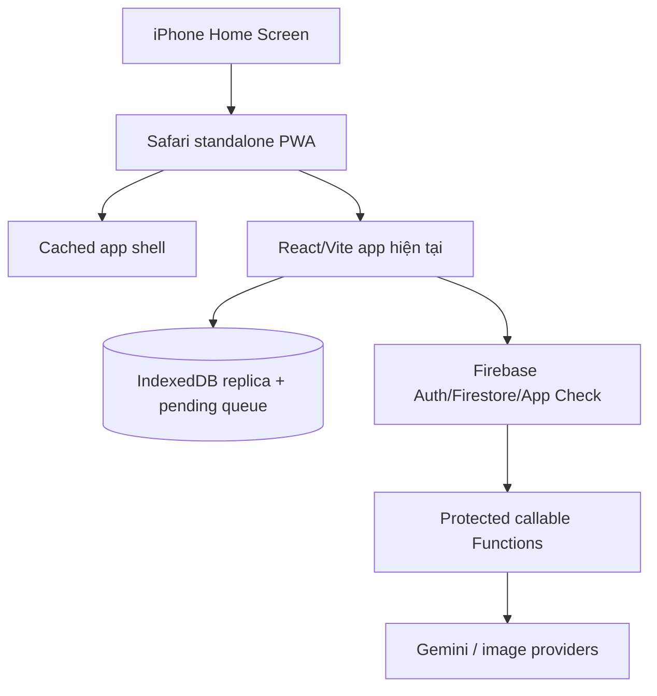

# Kế hoạch dùng Lingo Flash trên iPhone cá nhân, không trả phí Apple Developer

Ngày lập: 2026-08-21
Trạng thái: **Roadmap hiện hành**
Người dùng mục tiêu: một chủ sở hữu duy nhất
Chi phí Apple Developer: **0 USD**

## 1. Quyết định

### Phương án chính: Progressive Web App cài từ Safari

Giữ Lingo Flash là web app React/Vite hiện tại, bổ sung PWA manifest, service worker, update flow và kiểm thử iOS. Sau đó mở URL HTTPS trên Safari và chọn **Share → Add to Home Screen**.

Kết quả:

- Có icon trên Home Screen.
- Mở ở chế độ standalone, gần giống một app riêng.
- Không cần Apple Developer Program.
- Không cần App Store, TestFlight, EAS Submit hoặc provisioning profile.
- Không phải ký lại sau 7 ngày.
- Tái sử dụng toàn bộ UI, Firebase, IndexedDB mirror, FSRS, AI, catalog và browser-tested behavior hiện tại.

### Phương án phụ: Capacitor + Xcode Personal Team

Chỉ làm nếu PWA thiếu một native capability thực sự cần thiết. Capacitor bọc build Vite hiện tại vào một iOS container và cho phép thêm native plugin có chọn lọc.

Apple cho phép dùng Apple Account miễn phí để test trên thiết bị cá nhân qua **Xcode Personal Team**, nhưng giới hạn hiện hành gồm:

- Tối đa 10 App IDs đang đăng ký; từng App ID hết hạn sau 7 ngày.
- Tối đa 3 thiết bị test cho mỗi platform; từng đăng ký hết hạn sau 7 ngày.
- Provisioning profile hết hạn sau 7 ngày, thường phải build và cài lại app.
- Không có App Store/TestFlight, ad hoc distribution và advanced app capabilities của paid membership.

Nguồn: [Apple — Choosing a Membership](https://developer.apple.com/support/compare-memberships/).

### Không chọn React Native cho mục tiêu hiện tại

React Native vẫn phải viết lại UI, local storage, navigation và adapters trong khi bản cài miễn phí cũng hết hạn sau 7 ngày. Chi phí kỹ thuật không tương xứng với một người dùng. Kế hoạch React Native/App Store cũ chỉ nên hồi sinh nếu sau này muốn phát hành công khai.

## 2. So sánh nhanh

| Lựa chọn | Phí Apple | Hết hạn | Tái sử dụng app hiện tại | Native APIs | Khuyến nghị |
| --- | ---: | --- | ---: | --- | --- |
| PWA từ Safari | 0 USD | Không | Gần như toàn bộ | Hạn chế | **Chọn** |
| Capacitor + Personal Team | 0 USD | Profile 7 ngày | Rất cao | Có qua plugin, tùy entitlement | Chỉ khi PWA không đủ |
| React Native + Personal Team | 0 USD | Profile 7 ngày | Chủ yếu domain logic | Tốt | Không đáng cho một người dùng |
| App Store/TestFlight | 99 USD/năm | Không theo kiểu 7 ngày | Tùy stack | Đầy đủ | Ngoài phạm vi |

## 3. Phạm vi PWA cá nhân

### Giữ nguyên

- Today và daily plan.
- Vocabulary library, search, filter, decks và card detail.
- AI card creation, story, dialogue và extraction qua protected Functions.
- FSRS Study, Quiz, Spelling, Word Match.
- Progress, XP và streak.
- Guest/local library và account sync hiện tại.
- Offline IndexedDB mirror/pending mutation queue.
- Light/dark, responsive mobile layout và accessibility.

### Bổ sung

- Web app manifest và standalone display.
- App-shell offline cache.
- Safe service-worker update flow.
- iPhone safe-area/standalone layout fixes.
- Trang hướng dẫn Add to Home Screen.
- iOS storage/update/recovery checks.

### Có thể bị giới hạn trên PWA

- Shadowing/Web Speech: phải test trên đúng iPhone/iOS; nếu không support thì giữ playback + self-assessment fallback.
- Haptic: Safari/PWA không bảo đảm tương đương native.
- Notification lên lịch cục bộ: web/PWA trên iOS không nên được coi là bảo đảm; dùng due state trong app hoặc Shortcut/Reminder cá nhân nếu cần.
- Background sync: iOS có thể suspend PWA; sync authoritative vẫn chạy khi mở app/online.
- Share Extension native: không có trong PWA; dùng clipboard/share URL hoặc browser extension trên desktop.

## 4. Kiến trúc PWA

### Cache boundaries

Service worker chỉ chịu trách nhiệm app shell/static assets. Domain data vẫn do Firestore + IndexedDB hiện có quản lý.

Được cache:

- Versioned JS/CSS/font/icon assets.
- Navigation shell để mở app khi offline.
- Các asset public immutable có checksum/version.

Không cache bừa:

- Firebase Auth/Firestore/Functions requests.
- AI/image API responses có user input.
- Mutable `/health.json`.
- Mutable catalog release manifest.
- Shared deck URLs hoặc response chứa nội dung người dùng.

## 5. Ước lượng

### PWA khuyến nghị

- Installable shell cơ bản: **1–2 ngày**.
- Offline/update/auth compatibility: **2–4 ngày**.
- iPhone polish và acceptance: **1–2 ngày**.
- Tổng target: **4–8 ngày kỹ thuật**.

### Capacitor tùy chọn

- Basic wrapper + Xcode install: thêm **2–4 ngày**.
- Firebase/App Check/native plugin hardening: thêm **1–3 tuần**, tùy capability.
- Cứ mỗi 7 ngày phải chuẩn bị build/cài lại nếu tiếp tục dùng Personal Team.

## 6. Kế hoạch triển khai chi tiết

### Phase 0 — Personal-use contract (0.5 ngày)

#### Task 0.1 — Chốt URL HTTPS và install target — S

**Kết quả:** xác định URL Firebase Hosting dùng trên iPhone, model iPhone/iOS và account mode cần dùng.

**Acceptance criteria:**

- URL dùng HTTPS và mở được trên Safari iPhone.
- Quyết định guest-only hay cần Google sign-in/sync.
- Không dùng localhost làm install target lâu dài.

**Verification:** mở URL trên iPhone, vào Today/Vocabulary và reload thành công.

**Dependencies:** không.
**Files dự kiến:** tài liệu/checklist only.
**Scope:** S.

#### Task 0.2 — Export/backup dữ liệu cá nhân trước thay đổi cache — S

**Kết quả:** có một export thư viện hiện tại và biết cách phục hồi.

**Acceptance criteria:**

- Export mở/parse được.
- Không xóa IndexedDB hoặc cloud data trong quá trình PWA migration.
- Có rollback bằng cách unregister service worker và dùng web app bình thường.

**Verification:** export/import dry run với một fixture hoặc copy dữ liệu không-production.

**Dependencies:** Task 0.1.
**Files dự kiến:** không bắt buộc thay code.
**Scope:** S.

#### Task 0.3 — Chốt PWA Definition of Done — S

**Kết quả:** danh sách core journeys thực sự cần trên iPhone cá nhân.

**Acceptance criteria:**

- Ít nhất Today, create card, Study, offline reopen và sync được chọn.
- Shadowing/notification được ghi rõ required hoặc optional.
- Không có App Store/TestFlight requirement.

**Verification:** chủ dự án duyệt checklist.

**Dependencies:** Tasks 0.1–0.2.
**Files dự kiến:** tài liệu này.
**Scope:** S.

#### Checkpoint Phase 0

- URL, device, account mode và backup đã sẵn sàng.
- Không bắt đầu service worker khi chưa có rollback/export.

### Phase 1 — Installable PWA shell (1–2 ngày)

#### Task 1.1 — Thêm web app manifest — S

**Kết quả:** manifest có name/short name, theme/background color, standalone display, start URL và icons.

**Acceptance criteria:**

- Safari nhận đúng icon/tên.
- `start_url` mở Today hoặc route đã chọn mà không làm mất query/share semantics.
- Manifest không claim capability app chưa có.

**Verification:** production build chứa manifest; iPhone Add to Home Screen preview đúng.

**Dependencies:** Task 0.1.
**Files dự kiến:** mới `public/manifest.webmanifest`, `index.html`.
**Scope:** S.

#### Task 1.2 — Hoàn thiện iOS standalone metadata — S

**Kết quả:** theme/status-bar/touch icon/viewport/safe-area metadata nhất quán.

**Acceptance criteria:**

- Existing 180px touch icon được dùng đúng.
- Status bar và background không flash màu sai lúc launch.
- Viewport không phá zoom/accessibility.

**Verification:** cold launch từ Home Screen ở light/dark mode.

**Dependencies:** Task 1.1.
**Files dự kiến:** `index.html`, có thể thêm launch/icon assets nếu thật sự cần.
**Scope:** S.

#### Task 1.3 — Add to Home Screen instructions — S

**Kết quả:** hướng dẫn riêng cho Safari iOS khi app chưa ở standalone mode.

**Acceptance criteria:**

- Copy ngắn: Share → Add to Home Screen.
- Không hiện lại khi đã standalone hoặc đã dismiss.
- Không giả mạo native install prompt mà Safari không cung cấp.

**Verification:** Safari regular tab, dismissed state và standalone state tests.

**Dependencies:** Task 1.1.
**Files dự kiến:** install helper/model/component và tests.
**Scope:** M nếu có UI; S nếu chỉ tài liệu cá nhân.

#### Checkpoint Phase 1

- Icon cài được, mở standalone và đi đúng route.
- Web app bình thường vẫn hoạt động như trước.

### Phase 2 — Offline shell và safe update (2–3 ngày)

#### Task 2.1 — Thêm versioned service worker — M

**Kết quả:** hashed build assets và minimal navigation shell có thể mở offline.

**Acceptance criteria:**

- Service worker không intercept Firebase/Functions requests.
- Cache version đổi theo build và old cache được cleanup có kiểm soát.
- First install failure không làm web app trắng màn hình.

**Verification:** production build + browser service-worker tests + offline Home Screen launch.

**Dependencies:** Phase 1.
**Files dự kiến:** service worker source, registration module, Vite/build integration, tests.
**Scope:** M.

#### Task 2.2 — Navigation fallback và cache allowlist — M

**Kết quả:** app route/deep link mở shell offline mà không cache mutable/private endpoints.

**Acceptance criteria:**

- `/`, `/library` và supported query routes load shell.
- `/health.json`, catalog manifest, Firebase và shared data bị loại khỏi shell cache.
- Cross-origin image/audio failure dùng UI fallback hiện có.

**Verification:** offline route matrix và cache-content inspection.

**Dependencies:** Task 2.1.
**Files dự kiến:** service worker routing policy + tests.
**Scope:** M.

#### Task 2.3 — Safe update UX — M

**Kết quả:** khi có worker/build mới, app báo update hoặc áp dụng ở safe boundary thay vì reload giữa lesson/mutation.

**Acceptance criteria:**

- Không tự reload khi đang edit, import, sync hoặc trong lesson.
- User có thể chọn Update now; reload chỉ sau pending local transaction an toàn.
- Version mismatch có recover action, không infinite reload.

**Verification:** old→new build simulation và pending-session tests.

**Dependencies:** Tasks 2.1–2.2.
**Files dự kiến:** update controller, feedback component, tests.
**Scope:** M.

#### Task 2.4 — Firebase/Auth/App Check standalone compatibility — M

**Kết quả:** guest và, nếu cần, Google sign-in/sync hoạt động trong Home Screen standalone mode.

**Acceptance criteria:**

- Redirect/popup return đúng app state trên iOS.
- Authorized domains và App Check web provider giữ nguyên production enforcement.
- Auth failure không xóa local library; guest mode vẫn dùng được.

**Verification:** physical iPhone sign-in/out, force-close/reopen, offline reopen và protected AI call.

**Dependencies:** Tasks 2.1–2.3.
**Files dự kiến:** chỉ sửa identity/browser adapter nếu device test chứng minh cần; thêm focused tests.
**Scope:** M.

#### Checkpoint Phase 2

- Home Screen app mở được khi offline sau một lần online load.
- Update không làm mất draft/session/pending mutation.
- Protected Firebase/AI behavior không bị service worker phá.

### Phase 3 — iPhone polish và personal acceptance (1–2 ngày)

#### Task 3.1 — Standalone safe-area/layout polish — M

**Kết quả:** header, bottom nav, dialogs và keyboard không bị notch/home indicator che.

**Acceptance criteria:**

- Portrait/landscape ở device mục tiêu không horizontal overflow.
- Bottom navigation không nằm dưới home indicator.
- Software keyboard không che input/action chính.

**Verification:** physical-device screenshots và core route walkthrough.

**Dependencies:** Phase 2.
**Files dự kiến:** `src/index.css` và tối đa 1–2 shell components/tests.
**Scope:** M.

#### Task 3.2 — Audio/Shadowing fallback — M

**Kết quả:** pronunciation luôn usable; Shadowing degrade rõ ràng nếu iOS PWA không hỗ trợ recognition.

**Acceptance criteria:**

- Audio chỉ phát sau user gesture và xử lý interruption/failure.
- Unsupported speech recognition không hiển thị dead mic button.
- Fallback là nghe → tự đọc → self-assessment, không fake transcript/score.

**Verification:** device test cho supported/unsupported/permission-denied paths.

**Dependencies:** Phase 2.
**Files dự kiến:** browser capability adapter, Shadowing presentation/tests nếu cần.
**Scope:** M.

#### Task 3.3 — Storage health và recovery — M

**Kết quả:** người dùng thấy rõ local/cloud state và có export/retry/reload recovery.

**Acceptance criteria:**

- Storage denial/quota/eviction không crash startup.
- Pending count và sync error vẫn actionable.
- Clear website data warning nói rõ local guest data có thể mất.

**Verification:** denied storage, low-space simulation where possible, offline mutation/reopen/export journey.

**Dependencies:** Phase 2.
**Files dự kiến:** storage health model/feedback/tests nếu current UI chưa đủ.
**Scope:** M.

#### Task 3.4 — Physical iPhone acceptance — M

**Kết quả:** retained checklist cho đúng iPhone/iOS của chủ dự án.

**Acceptance criteria:**

- Today → lesson → rating, create card, search, Study và Progress pass.
- Online/offline/force-close/update/sign-in states pass theo scope.
- Dynamic Type/VoiceOver/reduced motion cơ bản usable.

**Verification:** manual acceptance record gắn build revision và URL.

**Dependencies:** Tasks 3.1–3.3.
**Files dự kiến:** mới `docs/reviews/ios-personal-pwa-acceptance.md`.
**Scope:** M kiểm thử.

#### Checkpoint Phase 3 — Hoàn thành PWA cá nhân

- App dùng hàng ngày được từ Home Screen mà không trả phí hoặc ký lại.
- Core data/learning flow không regress.
- Known limitations được ghi đúng, không cố giả lập native capability.

### Phase 4 — Capacitor fallback, chỉ mở nếu PWA không đủ

#### Gate 4.0 — Chứng minh nhu cầu native — S

Chỉ qua gate nếu một capability required trong Task 0.3 thất bại trên PWA và không có web fallback chấp nhận được.

**Verification:** issue có reproduction trên physical iPhone và quyết định chủ dự án.

#### Task 4.1 — Basic Capacitor wrapper — M

**Kết quả:** Vite `dist` được sync vào iOS project và chạy trong WKWebView.

**Acceptance criteria:**

- `webDir` trỏ đúng production output.
- Web build vẫn deploy độc lập.
- Wrapper không chứa provider secret.

**Verification:** `npm run build`, `npx cap sync`, `npx cap open ios`, Xcode run trên iPhone.

**Dependencies:** Gate 4.0.
**Files dự kiến:** Capacitor config, package dependencies/scripts, generated `ios/` project.
**Scope:** M.

#### Task 4.2 — Personal Team signing runbook — S

**Kết quả:** Xcode dùng Apple Account miễn phí, device Developer Mode và Personal Team.

**Acceptance criteria:**

- Không yêu cầu paid certificate hoặc App Store record.
- Bundle ID không đụng production public identifier ngoài kiểm soát.
- Người dùng biết app phải build/cài lại sau khi profile hết hạn.

**Verification:** cài, mở và ghi nhận expiry của embedded provisioning profile.

**Dependencies:** Task 4.1.
**Files dự kiến:** mới `docs/runbooks/ios-personal-reinstall.md`.
**Scope:** S.

#### Task 4.3 — Capacitor Firebase/App Check spike — M

**Kết quả:** auth, Firestore và protected callable chạy trong WKWebView hoặc qua adapter native được chứng minh.

**Acceptance criteria:**

- Không tắt App Check production để wrapper hoạt động.
- Nếu dùng debug token cho đúng một personal device/app, token không commit và có revoke procedure.
- Wrong-origin/expired-profile/offline errors không xóa local data.

**Verification:** device smoke với staging/personal Firebase app và protected callable.

**Dependencies:** Task 4.2.
**Files dự kiến:** Firebase/App Check adapter/config/tests chỉ khi cần.
**Scope:** M.

#### Task 4.4 — Thêm đúng một native capability — M

**Kết quả:** capability làm Phase 4 cần thiết được thêm qua plugin/adapter nhỏ nhất.

**Acceptance criteria:**

- Chỉ capability đã fail Gate 4.0 được thêm.
- Permission denial có fallback.
- Không kéo theo Share Extension/push/App Groups nếu Personal Team không cấp entitlement.

**Verification:** device success/denied/background test.

**Dependencies:** Task 4.3.
**Files dự kiến:** plugin config, one adapter, UI integration, tests.
**Scope:** M.

#### Task 4.5 — Weekly re-sign/reinstall routine — S

**Kết quả:** một lệnh/checklist build web, sync Capacitor, mở/chạy Xcode và xác nhận data behavior sau reinstall.

**Acceptance criteria:**

- Quy trình không xóa cloud data.
- Local-only data được export trước reinstall vì app container có thể thay đổi/mất.
- Mất Mac/Xcode hoặc quên re-sign không làm cloud account hỏng.

**Verification:** rehearsal sau profile cycle hoặc manual uninstall/reinstall với fixture data.

**Dependencies:** Tasks 4.2–4.4.
**Files dự kiến:** reinstall runbook và safe helper script nếu thật sự cần.
**Scope:** S.

## 7. Definition of Done

### PWA path

1. Lingo Flash xuất hiện trên Home Screen với đúng icon/name.
2. Mở standalone và đi vào Today, không có browser chrome không cần thiết.
3. Sau một lần online load, app shell mở được offline.
4. Today, create card, Vocabulary, Study và Progress dùng được theo personal scope.
5. Offline mutation/reopen/sync không mất dữ liệu.
6. Service worker không cache Firebase/private/mutable endpoints sai cách.
7. Update không reload giữa edit/import/lesson/sync.
8. iPhone safe area, keyboard, Dynamic Type và VoiceOver cơ bản pass.
9. Không cần Apple Developer Program, App Store, TestFlight hoặc ký lại.

### Capacitor fallback

1. Chỉ được thực hiện sau khi PWA có documented required-capability failure.
2. Build/cài được bằng Xcode Personal Team miễn phí.
3. Người dùng chấp nhận profile 7 ngày và có reinstall runbook.
4. Firebase/App Check không bị hạ bảo mật.
5. Local data được export/protect trước reinstall.

## 8. Rủi ro

| Rủi ro | Mức | Giảm thiểu |
| --- | --- | --- |
| Service worker giữ code cũ | High | Versioned cache, explicit update UI, no auto reload giữa operation |
| Cache nhầm Firebase/private data | Critical | Strict same-origin static allowlist; tests inspect cache contents |
| iOS xóa PWA storage khi thiếu dung lượng | High | Signed-in cloud sync, visible health, periodic export cho guest data |
| Google Auth/App Check khác trong standalone | High | Physical-device gate trước gọi PWA complete |
| Shadowing Web Speech không support | Medium | Capability detection và self-assessment fallback |
| Capacitor profile hết hạn mỗi 7 ngày | High | PWA là default; weekly reinstall runbook nếu vẫn chọn wrapper |
| Capacitor WKWebView làm App Check fail | High | Fail-fast spike; không disable production enforcement |
| Kế hoạch lại phình thành native rewrite | Medium | Gate 4.0 và mỗi lần chỉ thêm một required capability |

## 9. Cách dùng ngay, trước khi triển khai PWA đầy đủ

Nếu site hiện đã deploy HTTPS:

1. Mở site bằng Safari trên iPhone.
2. Bấm nút Share.
3. Chọn **Add to Home Screen**.
4. Đặt tên Lingo Flash/SonFlash rồi Add.

Codebase đã có `apple-touch-icon`, nên icon có thể hiển thị ngay. Tuy nhiên hiện chưa có manifest/service worker, vì vậy đây mới là shortcut web: standalone/offline/update behavior chưa đạt Definition of Done ở trên.

## 10. Nguồn

- [Apple — Choosing a Membership](https://developer.apple.com/support/compare-memberships/)
- [Apple — Running your app on simulated or physical devices](https://developer.apple.com/documentation/xcode/running-your-app-on-simulated-or-physical-devices)
- [Expo — Local app development](https://docs.expo.dev/guides/local-app-development/)
- [Capacitor — Installation](https://capacitorjs.com/docs/getting-started)
- [Kế hoạch App Store/native đầy đủ, chỉ để tham khảo sau này](ios-app-end-to-end-plan-2026-08-21.md)
